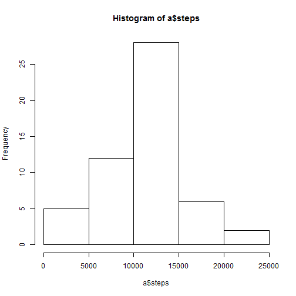
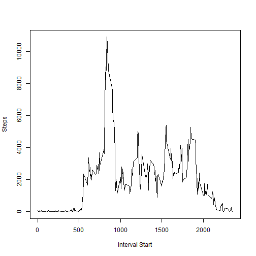
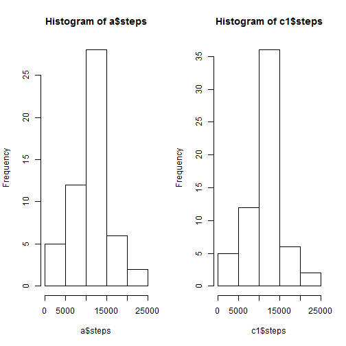
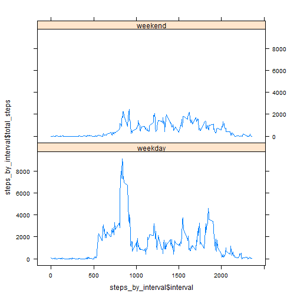

#Reproducible Research Project

##What is mean total number of steps taken per day?

Make a histogram of the total number of steps taken each day and then calculate and report the mean and median of the total number of steps taken per day, ignoring missing values.


```r
setwd("C:/Users/kkamali/Documents/r_Data")
if(!file.exists("repdata/act")){dir.create("./repdata/act")}

if(!file.exists("repdata/act/activity.csv")){
fileUrl <- "https://d396qusza40orc.cloudfront.net/repdata%2Fdata%2Factivity.zip"
download.file(fileUrl, "repdata/act/activity.zip")
unzip("repdata/act/activity.zip", exdir="repdata/act")
actData <- read.csv("repdata/act/activity.csv", na.strings = "NA")
} else actData <- read.csv("repdata/act/activity.csv", na.strings = "NA")

a<-aggregate(steps ~ date, data = actData, FUN=sum)
hist(a$steps)
```

 

```r
mean(a$steps)
```

```
## [1] 10766.19
```

```r
median(a$steps)
```

```
## [1] 10765
```
##What is the average daily activity pattern?
Make a time series plot (i.e. type = "l") of the 5-minute interval (x-axis) and the average number of steps taken, averaged across all days (y-axis)

Which 5-minute interval, on average across all the days in the dataset, contains the maximum number of steps?

```r
library(lubridate)
```

```
## Warning: package 'lubridate' was built under R version 3.1.3
```

```r
#actData$date <- strptime(actData$date, "%Y-%m-%d")
#actData$starttime <- fast_strptime(sprintf("%04d", actData$interval), "%H%M")
b <- aggregate(steps ~ interval, data = actData, sum, na.action = na.omit)
plot(b$interval, b$steps, type = "l", ylab = "Steps", xlab="Interval Start")
```

 

```r
b2<-b[order(b$steps, decreasing=TRUE),]
c(noquote("Interval with Max Steps: "),b2$interval[1])
```

```
## [1] Interval with Max Steps:  835
```

##Imputing missing values
Note that there are a number of days/intervals where there are missing values (coded as NA). The presence of missing days may introduce bias into some calculations or summaries of the data. Calculate and report the total number of missing values in the dataset (i.e. the total number of rows with NAs).


```r
c1 <- aggregate(steps ~ date, data = actData, sum, na.action = na.pass)
summary(c1)
```

```
##          date        steps      
##  2012-10-01: 1   Min.   :   41  
##  2012-10-02: 1   1st Qu.: 8841  
##  2012-10-03: 1   Median :10765  
##  2012-10-04: 1   Mean   :10766  
##  2012-10-05: 1   3rd Qu.:13294  
##  2012-10-06: 1   Max.   :21194  
##  (Other)   :55   NA's   :8
```

The finding here is that there are 8 rows with NA step values. In addition, this summary shows a maximum daily count of 21,194 steps, which is significantly higher than observed in previous project analysis steps.

Devise a strategy for filling in all of the missing values in the dataset. The strategy does not need to be sophisticated. For example, you could use the mean/median for that day, or the mean for that 5-minute interval, etc.Create a new dataset that is equal to the original dataset but with the missing data filled in.


```r
c1$steps <- replace(c1$steps, is.na(c1$steps), median(a$steps))
```
Make a histogram of the total number of steps taken each day and Calculate and report the mean and median total number of steps taken per day. Do these values differ from the estimates from the first part of the assignment? What is the impact of imputing missing data on the estimates of the total daily number of steps?

```r
par(mfrow = c(1,2))
hist(a$steps)
hist(c1$steps)
```

 

```r
mean(c1$steps)
```

```
## [1] 10766.03
```

```r
median(c1$steps)
```

```
## [1] 10765
```

```r
c(noquote("Change in Mean Steps: "),format(mean(a$steps)-mean(c1$steps),digits=2))
```

```
## [1] Change in Mean Steps:  0.16
```

```r
c(noquote("Change in Median Steps: "),format(median(a$steps)-median(c1$steps),digits=2))
```

```
## [1] Change in Median Steps:  0
```

##Does activity pattern vary between weekdays and weekends?
For this part the weekdays() function may be of some help here. Use the dataset with the filled-in missing values for this part. Create a new factor variable in the dataset with two levels - "weekday" and "weekend" indicating whether a given date is a weekday or weekend day.  


```r
actData$daytype <- ifelse(wday(ymd(actData$date),label=TRUE)=="Sun"|wday(ymd(actData$date),label=TRUE)=="Sat","weekend","weekday")
```
Make a panel plot containing a time series plot (i.e. type = "l") of the 5-minute interval (x-axis) and the average number of steps taken, averaged across all weekday days or weekend days (y-axis).  


```r
library(plyr)
```

```
## Warning: package 'plyr' was built under R version 3.1.3
```

```
## 
## Attaching package: 'plyr'
## 
## The following object is masked from 'package:lubridate':
## 
##     here
```

```r
library(lattice)
```

```
## Warning: package 'lattice' was built under R version 3.1.3
```

```r
# calculate avg steps per interval so we can replace NAs with this
stepinterval <- ddply(actData, .(daytype, interval), summarize, mean_steps=mean(steps, na.rm=TRUE))
mediansteps = median(stepinterval$mean_steps)
steps_by_interval <- ddply(actData, .(daytype, interval), summarize, total_steps=sum(steps, na.rm=TRUE))
steps_by_interval$total_steps <- replace(steps_by_interval$total_steps, is.na(steps_by_interval$total_steps), mediansteps)
xyplot(steps_by_interval$total_steps ~ steps_by_interval$interval|steps_by_interval$daytype, data=steps_by_interval, layout = c(1,2), type = "l")
```

 

  That wasn't the most elegantly resolved problem in the world...
